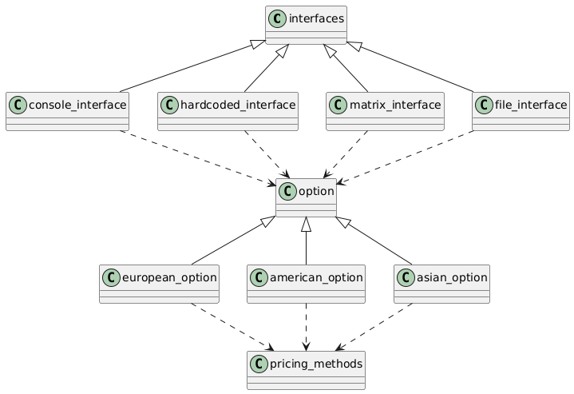

---

# **Optimized Option Pricer**


---

## **About**  
An advanced C++ application for option pricing, building on previous work to enhance speed, modularity, and scalability. This project supports European, American, and Asian options using the Black-Scholes model and numerical methods. It includes four user interfaces and leverages the **Boost Library** for enhanced functionality and efficiency.

---

## **UML Diagram**  
The class structure and design dependencies are captured in the following UML diagram:



---

## **Demo**  
Watch the full demo of the project:  

[](https://youtu.be/MLFRqJ9nKtE)  
*Click the thumbnail to watch the video.*

---

## **Features**
- **Pricing Models**:
  - European and American perpetual options priced via Black-Scholes and numerical methods.
  - Asian options priced using advanced simulations.
- **Interfaces**:
  - Multiple user interfaces for flexibility in input handling and interaction.
- **Optimizations**:
  - Modular design for improved maintainability and scalability.
  - Integration with the **Boost Library** for enhanced performance and data handling.

---

## **Structure**
- **Core Classes**:
  - `european_option`, `american_option`, `asian_option`: Implement pricing logic for different option types.
- **Interfaces**:
  - Includes console-based and file-based interaction for user inputs and outputs.
- **Numerical Methods**:
  - Implements efficient techniques for solving pricing equations.

---

## **Usage**  
### **Compilation**
1. Clone the repository:
   ```bash
   git clone https://github.com/markbogorad/Optimized_Option_Pricer.git
   cd Optimized_Option_Pricer
   ```

2. Build the project using `CMake`:
   ```bash
   mkdir build && cd build
   cmake ..
   make
   ```

3. Run the executable:
   ```bash
   ./OptionPricer
   ```

### **Requirements**
- **C++ Compiler**: C++20 or later.
- **CMake**: Version 3.20 or later.
- **Boost Library**: Installed and available at `/usr/local/opt/boost/include`.

---

## **Future Improvements**
1. Extend support for additional exotic options like Barrier and Lookback options.
2. Optimize computations for multi-threaded environments.
3. Implement GPU-based acceleration for faster numerical computations.

---

## **License**
This project is licensed under the **MIT License**. See the [LICENSE](./LICENSE) file for details.

---
